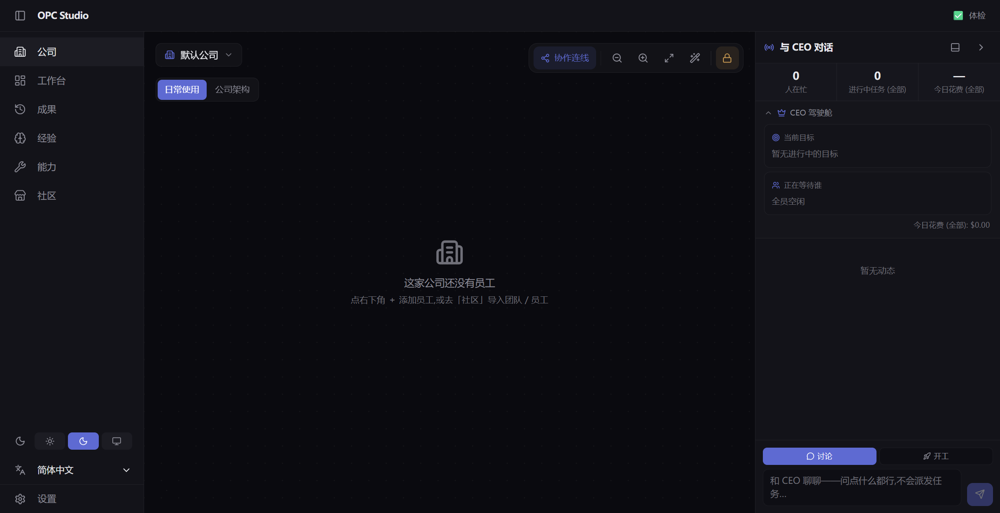

<div align="center">

# OPC Studio

**Ein lokal orientiertes, überprüfbares Arbeitssystem für langlebige KI-Teams.**

[English](./README.md) · [简体中文](./README_ZH.md) · [日本語](./README_JA.md) · [Deutsch](./README_DE.md)

[](https://github.com/WUBING2023/OPCStudio/stargazers)
[](https://github.com/WUBING2023/OPCStudio/releases/latest)
[](https://github.com/WUBING2023/OPCStudio/releases/latest)
[](./LICENSE)

[Website](https://opcstudio.pages.dev/) · [Download](https://github.com/WUBING2023/OPCStudio/releases/latest) · [Dokumentation](#dokumentation) · [Problem melden](https://github.com/WUBING2023/OPCStudio/issues)

</div>



## Was ist OPC Studio?

OPC Studio organisiert API-Modelle und abonnementbasierte CLIs als wiederverwendbare KI-Unternehmen. Ein Unternehmen definiert dauerhafte Rollen, Verantwortlichkeiten, Berechtigungen, Werkzeuge, Prüfregeln und kontrollierten Speicher. Jede Mission erstellt einen passenden Aufgabengraphen und ein temporäres Ausführungsteam.

Das Ziel ist nicht, mehr Agents miteinander reden zu lassen. KI-Arbeit soll **nachvollziehbar, überprüfbar, wiederverwendbar und ehrlich gegenüber Fehlern** sein.

> **Release-Kanal:** Windows Private Alpha. Verwende zunächst nicht vertrauliche Testprojekte und prüfe die Provider-Berechtigungen sowie die [Sicherheitsgrenzen](./docs/security-boundary.md).

## Kernmodell

```text
Organisation  Rollen · Verantwortung · Rechte · Skills · MCP · Speicher
Aufgaben      Mission-Graph · Abhängigkeiten · Liefervertrag · Freigaben
Ausführung    Modellsitzungen · Worktrees · Werkzeuge · temporäre A2A-Nachrichten
Nachweise     Artefakte · Hashes · Tests · Herkunft · ehrlicher Endstatus
```

- **Dauerhafte Unternehmen** bewahren wiederverwendbare organisatorische Fähigkeiten.
- **Dynamische Teams** verhindern unnötige Vollbesetzung bei jeder Aufgabe.
- **Echte Arbeitsverzeichnisse** enthalten tatsächliche Dateiänderungen und herunterladbare Artefakte.
- **Unabhängige Verifikation** bindet Tests und Nachweise an die gelieferten Dateien.
- **Kontrollierter Speicher** trennt Vorschläge, freigegebene Erfahrungen, Ablehnungen und Widerrufe.
- **Versionierte Company Bundles** unterstützen Migration, Vertrauenshinweise und Treueprüfungen.

## Download

Der aktuelle Windows-Installer steht unter [GitHub Releases](https://github.com/WUBING2023/OPCStudio/releases/latest) bereit.

- Windows 10/11 x64
- Installer: ungefähr 127 MiB
- Installierte Größe: ungefähr 472 MiB
- API-Schlüssel und Anmeldedaten sind nicht enthalten

Das aktuelle Paket ist ausschließlich für Windows verfügbar. Die Quellcode-Entwicklung ist unter Windows, macOS und Linux möglich; Paket-Releases für weitere Plattformen sind noch nicht vollständig validiert.

## Start aus dem Quellcode

Benötigt werden Node.js 24.x und pnpm 11.7.0.

```bash
pnpm install --frozen-lockfile
pnpm dev
```

Öffne `http://localhost:5173`. Konfiguriere vor einer echten Ausführung einen API-Provider oder eine unterstützte Abonnement-CLI. Zugangsdaten müssen außerhalb des Repositorys gespeichert werden; siehe [Repository Setup](./docs/REPOSITORY_SETUP.md).

## Bauen und prüfen

```bash
pnpm -r typecheck
pnpm test
pnpm run test:security-gate
pnpm run build:electron
```

Der Windows-Installer wird nach `electron-app/release/` geschrieben.

## Architektur

```text
apps/web        React- und Vite-Oberfläche für Desktop und Web
apps/server     Steuerung, Orchestrierung, Speicher, Nachweise und Gedächtnis
apps/cli        Headless CLI, MCP Server, ACP- und native Ausführungsadapter
packages/shared Versionierte Verträge und Schemas
electron-app    Eigenständiges Windows-Desktop-Paket
integrations    Integrationspakete für Codex und Claude
```

## Community-Karte

Die [offizielle Website](https://opcstudio.pages.dev/#community) zeigt die echte Star-Anzahl und eine aggregierte Stargazer-Karte. Standorte stammen ausschließlich aus freiwillig veröffentlichten GitHub-Profilangaben und werden auf Länder-/Regionsebene zusammengefasst. Benutzernamen, Rohstandorte, Unternehmen, Biografien, Besucher-IP-Adressen und genaue Koordinaten werden nicht veröffentlicht. Stars werden nicht als Installationen oder aktive Nutzer ausgegeben.

## Sicherheitsmodell

OPC Studio führt leistungsfähige lokale Werkzeuge aus. Vorlagen, Skills, MCP Server und Abonnement-CLIs von Drittanbietern können weitreichende Host-Berechtigungen besitzen. Das System enthält Pfadschutz, SSRF-Schutz, Maskierung von Zugangsdaten, Freigabekontrollen, isolierte Arbeitsverzeichnisse und Nachweisprüfung, ist jedoch keine vollständige Container-Sandbox.

## Grenzen der Private Alpha

- Nur Windows x64 wurde als Paket und Installation vollständig getestet.
- Einige Ausführungspfade benötigen eine Anbieter-CLI und ein gültiges Konto.
- Abonnements melden Token, aber keine verlässlichen Kosten pro Anfrage.
- Mehrere Agents können langsamer und teurer als ein einzelner starker Agent sein.
- Signierung öffentlicher Vorlagen, Moderation, vollständiges Sandboxing und plattformübergreifende Installer werden noch entwickelt.

## Dokumentation

- [Repository Setup](./docs/REPOSITORY_SETUP.md)
- [Distribution](./docs/DISTRIBUTION.md)
- [Security Boundary](./docs/security-boundary.md)
- [Architecture decisions](./docs/adr/)
- [Product contract](./PRODUCT_CONTRACT.md)
- [Roadmap](./ROADMAP.md)

## Lizenz

Derzeit unter der [Apache License 2.0](./LICENSE) veröffentlicht.